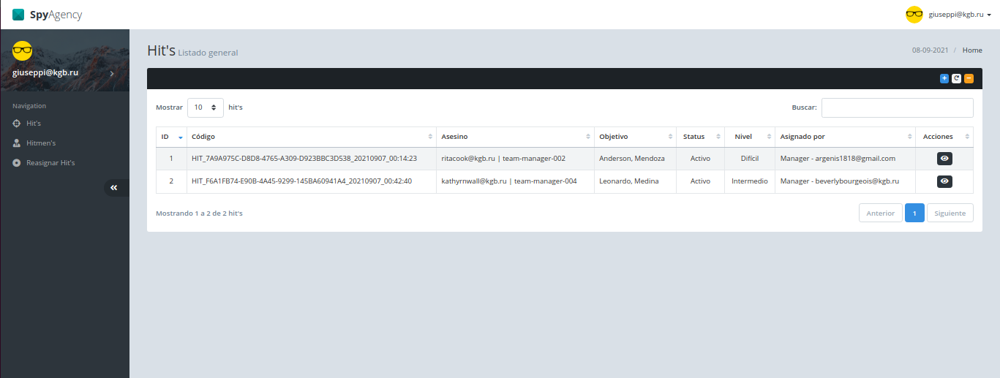
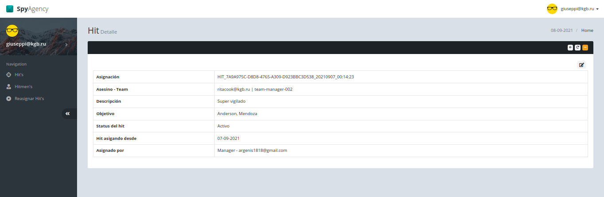
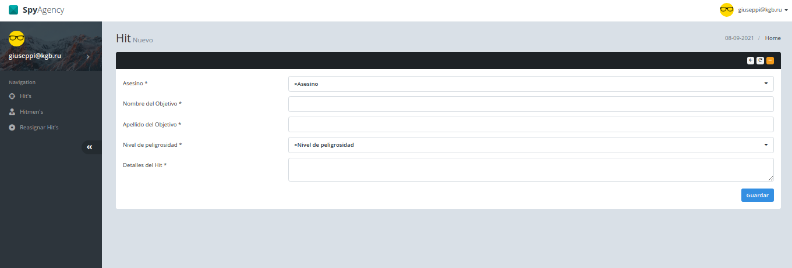
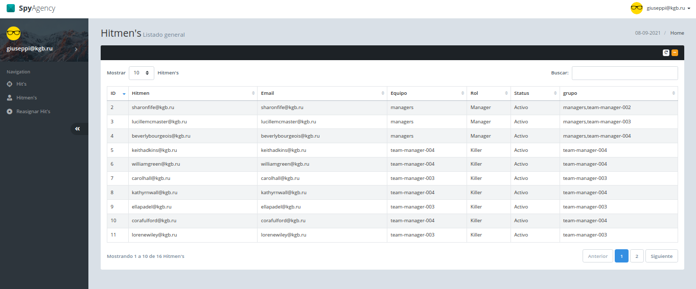
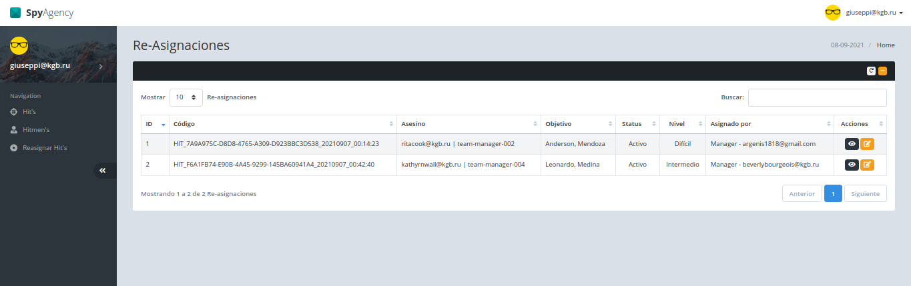

# Spy Agency

## <div id="indice">Índice</div>

1. [Introducción](#intro)
1. [Indicaciones](#indicaciones)
1. [Dependencias](#dependencias)
1. [RoadMap](#roadmap)
1. [Modelado](#models)
   - [Modelos del app Users](#users_model)
   - [Modelos del app Hit's](#hits_model)
1. [Vistas](#views)
   - [Hit's](#hits)
     - List
     - Detail
     - Create
   - [Hitmen](#hitmen)
     - List
   - [Bulk's](#bulks)

## <div id="intro">Introducción</div>

A modo de introducción el presente es un mini proyecto que a su vez sirve de test técnico para **JUSTO**, el mismo esta construido haciendo uso de Django Framework como marco de trabajo, su base de datos es sqlite, para la construcción de las apis se hace uso de Django Rest Framework y para authenticación de las mismas no se emplea el sistema base de Django, se emplea el plugins Json Web Token (jwt), se hace uso de mucho javascript y jquery, pero el backend esta diseñado para migrar en cualquier momento a tecnologías como VueJs o ReactJs entre otras.

[Regresar al Indice](#indice)

## <div id="indicaciones">Indicaciones</div>

- Crear una carpeta para el manejo de los `logs`, esta debe estar un nivel por encima del root del proyecto.

- Crear un archivo `.env`, este debe estar en el root del proyecto.

```.env
# spyagency/.env
DJANGO_SETTINGS_MODULE='config.settings.local'
SECRET_KEY="django-insecure-ha1qx^v^n%v%j7c2&*i@loby5jalsh9#&6)82i)kr(2(22%sr5"
DEBUG=True
ALLOWED_HOSTS=[]
```

- Crear un archivo `local.py`, este archivo debe estar en la ruta `spyagency/config/settings/`

```python
# spyagency/config/settings/local.py
from .base import *

ALLOWED_HOSTS = []

DATABASES = {
    "default": {
        "ENGINE": "django.db.backends.sqlite3",
        "NAME": BASE_DIR / "db.sqlite3",
    }
}

```
- Correr el comando `python3 manage.py migrate`, con este comando se ejecuta la creación de usuarios como se solicita en el doc de requerimientos.


[Regresar al Indice](#indice)
## <div id="dependencias">Dependencias</div>

Acá dejo un listado de las principales dependencias del proyecto, de igual manera en el repositorio de código para esta prueba se encuentra el archivo Pipfile, la `python_version = "3.9"`

- Django
- django-cors-headers
- django-filter
- django-simple-history
- django-url-filter
- djangorestframework
- djangorestframework-jwt
- drf-yasg
- flake8
- gunicorn
- ipython
- isort
- pep8
- Pillow
- psycopg2
- python-dateutil
- python-dotenv
- requests
- names
- django-autocomplete-light

[Regresar al Indice](#indice)

## <div id="roadmap">RoadMap</div>

### Version 0.1.0

- Definir estructura de Carpetas.
- Definir requerimientos iniciales.
- Separación de settings.
- Creación de aplicaciones iniciales:
  - **utils**, Manejo de utilidades propias del proyecto.
  - **users**, Administración de usuarios.
  - **hits**, Asiganción de asesinatos.
- Modularización de aplicaciones.
- Manejo de variables de entorno.

### Version 0.2.0

- Modelado de datos.
- Creación de Grupos y permisos de usuario.
- Creación de apis para usuarios, hits y target.
- Registro de usuarios.
- Login de usuarios.
- Vistas de listado génericas para hitmen, hit's y bulks.
- Creación de vista para crear hit's.
- Carga de archivos staticos.
- Se agrego el plugin Django Autocompletes Light

[Regresar al Indice](#indice)

## <div id="models">Modelado</div>

El modelado que se escogió para este caso en especifico fúe lo mas standart posible, el mismo se divide en las dos grandes apps que definen la prueba como tal, el primer modelo se encuentra en el app `Users`, y tiene por nombre User, extiende del modelo `AbstractUser` propio del framework y se le añadió uno que otro campo necesario para ajustartlo a la realidad de la prueba, los demás modelos se encuentran en la segunda aplicación `Hits`, estos son los modelos `Hit` y `Target`, el primero concentra información sobre la misión a cumplir, y el segundo administra la información de los objetivos.

Es importante mencionar que todos los modelos a excepción del modelo user extienden de un modelo Absrtacto que tiene campos de control.

**MODELO BASE**

```python
# utils/models.py
import uuid

from django.db import connection, models
from simple_history.models import HistoricalRecords


class BaseModel(models.Model):
    """
    Modelo Abstracto con historico de respaldo
    """

    transaction_id: str = models.UUIDField(
        db_index=True,
        null=True,
        blank=True,
        editable=False,
        verbose_name="Identificador",
        help_text="UUID",
        default=uuid.uuid4,
    )
    pub_date: str = models.DateTimeField(
        auto_now_add=True,
        editable=True,
        verbose_name="Fecha de Creación",
        help_text="DateTime",
    )
    mod_date: str = models.DateTimeField(
        auto_now=True, verbose_name="Fecha de modificación", help_text="DateTime"
    )
    is_active: bool = models.BooleanField(
        default=True, verbose_name="¿Activo?", help_text="Boolean"
    )
    history = HistoricalRecords(inherit=True)

    @classmethod
    def truncate(cls):
        """
        Truncate Table and Restart index. modo de aplicar truncate:
        Model.objects.all().model().truncate()
        """
        TABLE = cls._meta.db_table
        try:
            sql = f"TRUNCATE TABLE {TABLE} RESTART IDENTITY CASCADE;"
            with connection.cursor() as cursor:
                cursor.execute(sql)
        except Exception as e:
            error = str(e)
            print(f"Error en el truncado de tablas: {error}")

    class Meta:
        abstract = True
        ordering = ["-id"]


```

### <div id="users_model">Modelos del app Users</div> ###


```python
# users/models/user.py
# -*- coding: utf-8

# Librerias Standard
import os
from datetime import datetime

# Librerias Django
from django.contrib.auth.models import AbstractUser, Group
from django.db import models
from django.db.models import ImageField
from django.db.models.expressions import Case, F, Q, Value, When
from django.utils import timezone
from rest_framework import permissions

# Librerias en carpetas locales
from utils.sobre_escribir_avatar import SobreEscribirAvatar


def image_path(instance, filename):
    return os.path.join("avatar", str(instance.pk) + "." + filename.rsplit(".", 1)[1])


class User(AbstractUser):
    GENDER_CHOICES = (
        (1, "FEMENINO"),
        (2, "MASCULINO"),
    )
    gender: int = models.SmallIntegerField(choices=GENDER_CHOICES, default=GENDER_CHOICES[1][0], verbose_name="Género")
    bio: str = models.TextField(blank=True, null=True, verbose_name="Biografía")
    died: bool = models.BooleanField(
        default=False,
        verbose_name="Fallecido",
        help_text="Indica si no ha perdido la vida",
    )
    died_date: datetime = models.DateField(verbose_name="Fecha de muerte", blank=True, null=True)
    retired: bool = models.BooleanField(
        default=False, verbose_name="Retirado", help_text="Indica si no se ha retirado"
    )
    retired_date: datetime = models.DateField(verbose_name="Fecha de retiro", blank=True, null=True)
    avatar: ImageField = models.ImageField(
        max_length=255,
        storage=SobreEscribirAvatar(),
        upload_to=image_path,
        blank=True,
        null=True,
        default="avatar/default_avatar.png",
    )

    class Meta:
        ordering = ["-id"]
        verbose_name = "Usuario"
        verbose_name_plural = "Usuarios"
        db_table = "auth_user"
        permissions = [
            ("big_boss_menu", "Big Boss menu"),
            ("manager_menu", "Manager's menu"),
            ("hitmen_menu", "Hitmen menu"),
        ]

    def __str__(self):
        return f"{self.username}"

    @property
    def get_short_name(self):
        return "%s %s" % (self.first_name, self.last_name)

    @property
    def get_rol_name(self):
        if self.groups.filter(name__iexact="big_boss").exists():
            return "Big Boss"
        elif self.groups.filter(name__iexact="managers").exists():
            return "Manager"
        else:
            return "Killer"

    @property
    def get_team_name(self):
        if self.groups.filter(name__iexact="big_boss").exists():
            return "big_boss"
        elif self.groups.filter(name__iexact="managers").exists():
            return "managers"
        elif self.groups.exclude(id__in=[1, 2]).exists():
            return self.groups.exclude(id__in=[1, 2])[0].name
        else:
            return ""


```

### <div id="hits_model">Modelos del app Hits</div> ###

```python
# hits/models/hit.py
from django.db import models
from django.utils import timezone
from utils.models import BaseModel


class HitManager(models.Manager):
    def get_queryset(self):
        return self.select_related("hitmen", "target", "assigned_by")


class Hit(BaseModel):
    code_hit = models.CharField(
        max_length=100,
        verbose_name="Código",
        help_text="varchar(100) *",
        editable=False,
    )
    hitmen = models.ForeignKey(
        "users.User",
        on_delete=models.PROTECT,
        verbose_name="Asesino",
        related_name="hits",
    )
    target = models.ForeignKey(
        "hits.Target",
        verbose_name="Objetivo",
        on_delete=models.PROTECT,
        blank=True,
        null=True,
    )
    status = models.SmallIntegerField(
        choices=(
            (1, "Activo"),
            (2, "Finalizado"),
            (3, "Fallido"),
        ),
        default=1,
        verbose_name="Status del hit",
    )
    level = models.SmallIntegerField(
        choices=(
            (1, "Fácil"),
            (2, "Intermedio"),
            (3, "Difícil"),
        ),
        default=3,
        verbose_name="Level del hit",
    )
    hit_detail = models.TextField(
        blank=True,
        null=True,
        verbose_name="Detalles del hit",
        help_text="text no required",
    )
    status_detail = models.TextField(
        blank=True,
        null=True,
        verbose_name="Detalles del status",
        help_text="text no required",
    )
    assigned_by = models.ForeignKey(
        "users.User",
        on_delete=models.PROTECT,
        verbose_name="Asignado por",
        related_name="assigned_hits",
    )
    objects = HitManager()

    def save(self) -> None:
        if not self.pk:
            date = timezone.now().strftime("%Y%m%d_%H:%M:%S")
            self.code_hit = f"HIT_{str(self.transaction_id).upper()}_{date}"
        return super().save()

    def __str__(self) -> str:
        return f"{self.code_hit}"


```

```python
# hits/models/target.py
from django.db import models

from utils.models import BaseModel


class Target(BaseModel):
    first_name = models.CharField(
        max_length=60, verbose_name="Nombre", help_text="varchar(60) required*"
    )
    last_name = models.CharField(
        max_length=60, verbose_name="Apellido", help_text="varchar(60) required*"
    )
    created_by = models.ForeignKey(
        "users.User",
        on_delete=models.PROTECT,
        verbose_name="Creado por",
        related_name="targets",
    )
    extra_info = models.JSONField(
        verbose_name="Información adicional",
        help_text="json no required",
        blank=True,
        null=True,
    )

    def __str__(self):
        return f"{self.first_name}, {self.last_name}"

```
[Regresar al Indice](#indice)

### <div id="views">Vistas</div> ###

#### Hit's ####
- List, muestra el listado general de hit's.



- Detail, muestra el detalle de un hit, en él, si usted es un big boss o un manager puede editar tanto el estado como el hitmen, a través del botón edit de la parte superior en el detalle.



- Create, acá puede crear un nuevo hit si usted es un big boss o un manager.



#### Hitmen ####
- List, acá puede observar un listado general de asesinos


#### Bulk's ####
- List, acá en esta vista se generan las re-asignaciones dentro de la plataforma.


[Regresar al Indice](#indice)